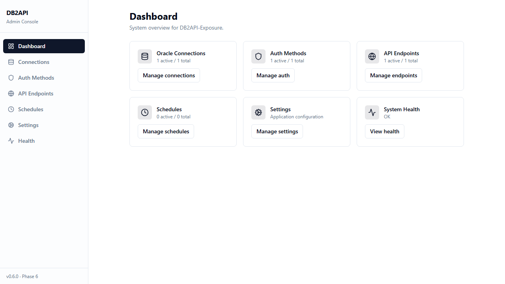

# QueryGateway

> A self-hosted platform that turns Oracle SQL queries into secure, versioned REST API endpoints — no application code required. Author a parameterized query in a guided wizard, attach authentication, choose a data-freshness strategy, and publish a live endpoint that other systems can consume.

QueryGateway is built for teams that need to expose data from an Oracle database over HTTP safely and quickly. Instead of writing and deploying a bespoke microservice for every report or integration, an administrator defines the query once through a web console, and QueryGateway handles routing, authentication, parameter validation, SQL safety, optional caching, and scheduled refresh.



## How It Works

```
Define connection ─▶ Author SQL (with :bind params) ─▶ Attach auth ─▶ Choose data strategy ─▶ Publish
                                                                                                  │
   API consumer ──── GET /api/v1/data/<your-endpoint> ──── authenticated, parameter-validated ────┘
```

1. **Connect** to your Oracle database with securely stored, encrypted credentials.
2. **Author** a `SELECT` query using named bind parameters (`:param_name`) in a rich SQL editor, and preview the results.
3. **Secure** the endpoint by attaching a Bearer token, Basic Auth, or API key policy.
4. **Choose** a data strategy: serve results **live** on each request, or from a **scheduled snapshot** cache.
5. **Publish** a versioned endpoint under `/api/v1/data/*` that resolves dynamically — no service restart needed.

## Features

QueryGateway is organized into five admin modules, all driven from the React admin console:

| Module | What it does |
|--------|--------------|
| **Connections** | Create, edit, test, and delete Oracle database connections. Credentials are encrypted at rest; pool sizing and timeouts are configurable. Uses `python-oracledb` (thin mode by default). |
| **API Creation Wizard** | A multi-step wizard that turns a parameterized SQL query into a deployable GET endpoint: pick a connection, author SQL with a rich editor, preview sample rows and inferred schema, map/rename output columns, attach an auth method, and select a data strategy. |
| **Authentication** | Manage per-endpoint auth methods — Bearer token (JWT), Basic Auth, and API key. Tokens are issued/verified with `PyJWT`; credentials are hashed with `bcrypt`. Middleware enforces a default-deny policy on all data endpoints. |
| **Scheduling & Snapshots** | Schedule query refreshes with APScheduler (persistent PostgreSQL job store). Run now, pause/resume, and enable/disable jobs. Results are cached as PostgreSQL JSONB snapshots and served with freshness metadata; jobs survive restarts. |
| **Settings & Health** | Configure runtime settings (base URL/port, logging level, query timeouts, CORS/rate-limit inputs) and view a health dashboard covering API, PostgreSQL, Oracle connectivity, scheduler status, and recent job outcomes. |

### Security by Default

- **SQL injection resistant** — user-defined SQL runs only through SQLAlchemy `text()` with named bind parameters. Request values are never concatenated into SQL strings, and bind values are validated through typed schemas before execution.
- **Encrypted credentials** — Oracle connection secrets are encrypted at rest using an environment-provided key.
- **Per-endpoint authentication** — every `/api/v1/data/*` endpoint requires an explicitly attached auth policy before it can serve traffic.
- **Structured, redacted logging** — `structlog` emits JSON logs with correlation fields (`request_id`, `user`, `endpoint`, `status`, `duration_ms`); credentials and tokens are redacted before emission.

### Two API Surfaces

| Namespace | Purpose | Who calls it |
|-----------|---------|--------------|
| `/api/v1/admin/*` | Manage connections, auth, endpoints, schedules, settings, and health | The admin SPA |
| `/api/v1/data/*` | Serve dynamic data from live queries or cached snapshots | Your API consumers |

All routes are versioned from day one; breaking contract changes are introduced under a new version path rather than mutating `v1`.

## Platform Support

- Development: Windows and Ubuntu/Linux
- Deployment: Ubuntu/Linux (recommended)
- Docker workflow: supported on both Windows (Docker Desktop) and Ubuntu/Linux

> **Python version:** Python 3.12 or 3.13 is required. Python 3.14 is not yet supported — `asyncpg` does not have stable wheels for CPython 3.14. If you have Python 3.14 installed, install Python 3.12 or 3.13 and create the virtual environment with the correct interpreter: `py -3.12 -m venv .venv` (Windows) or `python3.12 -m venv .venv` (Linux).

## Quick Start

```sh
# Install dependencies
make setup

# Run checks
make check

# Start with Docker
cp .env.example .env   # Set JWT_SECRET_KEY and ENCRYPTION_KEY (see deployment.md for generation commands)
make docker-up
```

- Backend API: `http://localhost:8000` — interactive docs at `/api/docs`
- Frontend SPA: `http://localhost:80`

## Local Run (Without Docker)

> **Python version:** Use Python 3.12 or 3.13. Python 3.14 is not yet supported (`asyncpg` has no wheels for CPython 3.14).
>
> **Note (Windows):** `psycopg2-binary` may fail to build from source if PostgreSQL dev tools are not installed. The `requirements.txt` uses a relaxed pin (`>=2.9.9`) so pip selects a pre-built wheel automatically. Always run `pip install --upgrade pip` first.

### Windows (PowerShell)

```powershell
# Step 1 — Start PostgreSQL (skip if already running)
docker run -d --name db2api-pg `
  -e POSTGRES_USER=db2api -e POSTGRES_PASSWORD=db2api -e POSTGRES_DB=db2api `
  -p 5432:5432 postgres:16
# Wait ~5 seconds for PostgreSQL to initialize before continuing

# Step 2 — Backend
cd backend
py -3.12 -m venv .venv
.venv\Scripts\Activate.ps1
pip install --upgrade pip
pip install -r requirements.txt
Copy-Item .env.example .env
# edit .env — set ENCRYPTION_KEY and JWT_SECRET_KEY before continuing

# Step 3 — Run database migrations
alembic upgrade head

# Step 4 — Start the backend
uvicorn app.main:app --reload
```

```powershell
# Frontend (new terminal)
cd frontend
npm install
npm run dev
```

### Ubuntu/Linux (bash)

```bash
# Step 1 — Start PostgreSQL (skip if already running)
docker run -d --name db2api-pg \
  -e POSTGRES_USER=db2api -e POSTGRES_PASSWORD=db2api -e POSTGRES_DB=db2api \
  -p 5432:5432 postgres:16
# Wait ~5 seconds for PostgreSQL to initialize before continuing

# Step 2 — Backend
cd backend
python3.12 -m venv .venv
source .venv/bin/activate
pip install --upgrade pip
pip install -r requirements.txt
cp .env.example .env
# edit .env — set ENCRYPTION_KEY and JWT_SECRET_KEY before continuing

# Step 3 — Run database migrations
alembic upgrade head

# Step 4 — Start the backend
uvicorn app.main:app --reload
```

```bash
# Frontend (new terminal)
cd frontend
npm install
npm run dev
```

### Local URLs

- API docs (Swagger): `http://localhost:8000/api/docs`
- Health check: `http://localhost:8000/api/v1/admin/health/live`
- Frontend SPA: `http://localhost:5173` (start frontend dev server first — see above)

> **Note:** `http://localhost:8000/` returns 404 — the backend serves no root route. All API routes are under `/api/v1/`.

## Development

```sh
make backend-dev    # FastAPI dev server on :8000 (hot reload)
make frontend-dev   # Vite dev server on :5173 (proxy /api to :8000)
```

Note: `make` targets are POSIX-oriented and work natively on Ubuntu/Linux. On Windows, run the platform-specific commands above, or use WSL/Git Bash with `make`.

## Database Migrations

```sh
cd backend
# Apply all pending migrations
alembic upgrade head

# Create a new migration after model changes
alembic revision --autogenerate -m "describe change"

# Rollback one step
alembic downgrade -1
```

## Documentation

- [Architecture](docs/architecture.md) — system components, design decisions, directory layout
- [Implementation Plan](project_plan.md) — modules, scope, and phased delivery
- [Deployment](docs/deployment.md) — self-hosted setup and secret generation
- [Operations](docs/operations.md) — backup/restore, monitoring, troubleshooting
- [Security Checklist](docs/security_checklist.md) — security validation controls
- [Conventions](docs/conventions.md) — coding standards
- [Contributing](docs/contributing.md) — onboarding guide
- [Progress](docs/progress.md) — implementation status

## Tech Stack

| Layer | Technologies |
|-------|-------------|
| Backend | Python 3.12+, FastAPI, SQLAlchemy 2.0, Alembic, APScheduler 3.x, PyJWT, bcrypt, structlog |
| Frontend | Vite 6, React 18, TypeScript, shadcn/ui, Tailwind CSS 3, Vitest |
| App DB | PostgreSQL 16 (asyncpg) |
| Data Source | Oracle (python-oracledb thin mode) |
| CI/CD | GitHub Actions — backend (ruff/mypy/pytest), frontend (eslint/prettier/vitest), Docker build |
